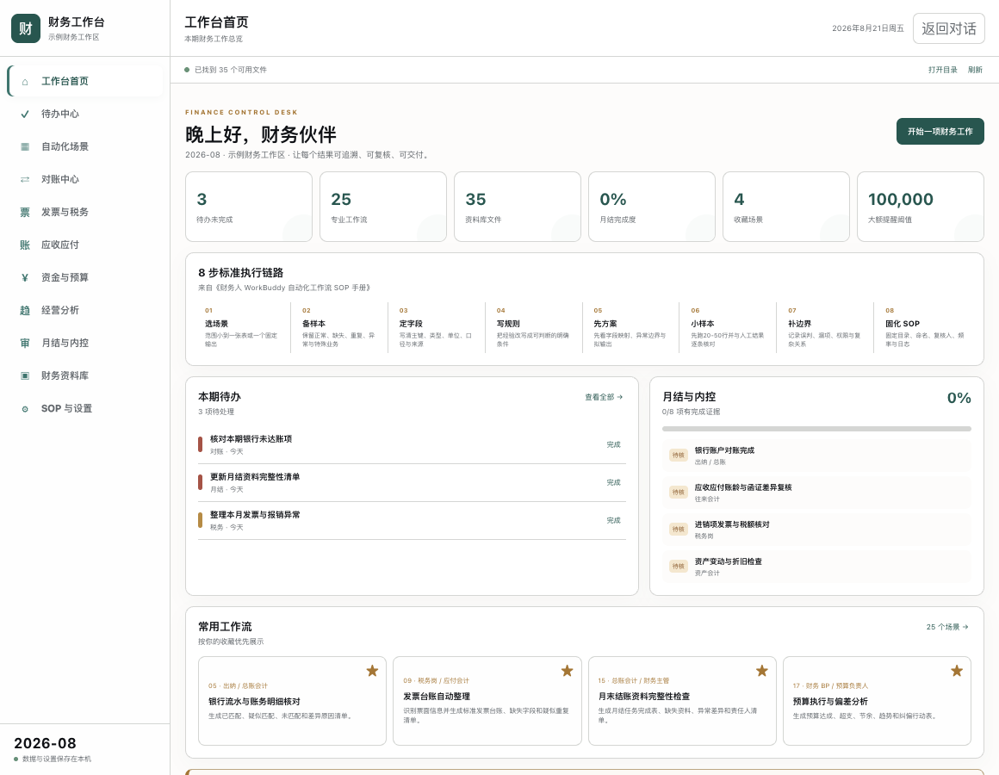
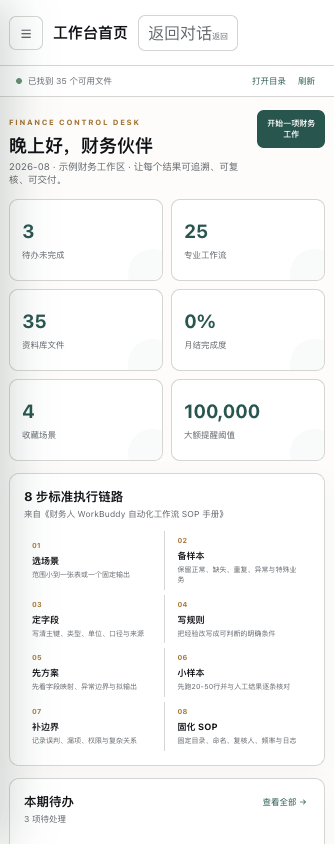

# WorkBuddy 财务工作台

[](https://github.com/feng-liu-1994/workbuddy-finance-workbench/actions/workflows/ci.yml)
[](https://github.com/feng-liu-1994/workbuddy-finance-workbench/releases)
[](LICENSE)

一个面向财务人员的开源 AI 工作台：把对账、发票税务、应收应付、资金预算、经营分析和月结内控，整理成可执行、可复核、可留痕的标准流程。

它提供两种使用方式：

- **DeepSeek Harness 图形工作台**：获得与截图一致的完整界面、资料库和任务发起体验。
- **WorkBuddy / Codex / Claude 等 AI Agent Skill**：安装 `agents/finance-workbench`，让支持技能目录的智能体直接使用 25 个财务工作流。其他智能体也可以直接读取 `SKILL.md` 和工作流目录。

> 重要说明：其他 AI Agent 安装的是同一套财务方法、规则与验收闭环；完整可视化界面目前由 DeepSeek Harness 插件提供。



<p align="center"></p>

## 主要能力

| 模块 | 能做什么 |
|---|---|
| 工作台首页 | 待办、25 个工作流、资料库数量、月结完成度和人工复核红线 |
| 待办中心 | 分类、优先级、截止日期、完成与恢复 |
| 自动化场景 | 22 个标准财务场景 + 3 个专业扩展 |
| 对账中心 | 多表清洗、重复检查、银行流水与账务核对、三表勾稽 |
| 发票与税务 | 发票台账、票款匹配、进销项核对、报销异常 |
| 应收应付 | 账龄、催收、付款排期、合同节点 |
| 资金与预算 | 大额约束、预算偏差、滚动现金流 |
| 经营分析 | 指标分析、降本分析、管理摘要 |
| 月结与内控 | 8 项证据清单、责任人、完成度与复核记录 |
| 财务资料库 | 上传、文件夹导入、拖放、搜索、筛选、置顶、引用、下载 |
| SOP 与设置 | 8 步搭建法、字段字典、业务阈值和 JSON 备份恢复 |

每个工作流都包含：岗位定位、输入资料、字段口径、关键规则、7 步执行流程、固定交付物、验收清单和人工复核边界。

## 新手怎么选

| 你的环境 | 推荐安装 | 结果 |
|---|---|---|
| 已安装 DeepSeek Harness | [安装完整图形工作台](docs/INSTALL_DSH.md) | 完整界面与资料库 |
| 使用 WorkBuddy | [安装 WorkBuddy Skill](docs/INSTALL_AGENT.md#workbuddy-安装) | 25 个财务工作流供 Agent 调用 |
| 使用 Codex | [安装 Codex Skill](docs/INSTALL_AGENT.md#codex-安装) | 在项目中执行财务任务 |
| 使用 Claude Code | [安装 Claude Skill](docs/INSTALL_AGENT.md#claude-code-安装) | 读取相同 SOP 与规则 |
| 其他 AI Agent | 让 Agent 读取 `agents/finance-workbench/SKILL.md` | 通用 Markdown/JSON 方式 |

## 最简单的安装方式

### WorkBuddy

```bash
git clone https://github.com/feng-liu-1994/workbuddy-finance-workbench.git
cd workbuddy-finance-workbench
./scripts/install-agent.sh workbuddy
```

安装后重新打开 WorkBuddy，新建任务时可以直接说：

```text
请使用 finance-workbench，先检查字段和口径，再核对这两份银行流水与账务明细。
```

### DeepSeek Harness 完整界面

```bash
git clone https://github.com/feng-liu-1994/workbuddy-finance-workbench.git
cd workbuddy-finance-workbench
./scripts/install-dsh.sh
```

脚本会先备份配置，再安装依赖、运行测试并注册插件。详细步骤与恢复方法见 [DeepSeek Harness 安装指南](docs/INSTALL_DSH.md)。

### 不想使用终端

1. 打开 [Releases](https://github.com/feng-liu-1994/workbuddy-finance-workbench/releases)。
2. 下载 `finance-workbench-agent-v2.0.0.zip`。
3. 解压后，把 `finance-workbench` 文件夹放到 WorkBuddy 的 `~/.workbuddy/skills/`。
4. 重新打开 WorkBuddy。

Windows 用户可在 PowerShell 中运行：

```powershell
.\scripts\install-agent.ps1 workbuddy
```

## 第一次使用

1. 在“设置”中修改称呼、主体、期间和金额阈值。
2. 把脱敏后的资料放入工作区，或在资料库中上传。
3. 从“自动化场景”选择工作流。
4. 先确认字段映射、口径、异常规则和拟输出。
5. 使用 20–50 行样本试跑并人工核对。
6. 确认后再处理全量，保留结果、异常清单和日志。

仓库提供了完全虚构的 [演示数据](examples/demo/README.md)，可以安全练习。

## 数据安全边界

- 仓库不包含真实发票、银行流水、个人身份信息、公司数据、密码、Cookie、Token 或 API Key。
- 待办、收藏、字段字典和阈值默认保存在浏览器本机 `localStorage`。
- JSON 设置备份不包含原始财务资料。
- 工作流只处理副本，不应覆盖、移动或删除原件。
- OCR 和 AI 推断不能直接作为入账、付款、纳税申报或违规认定依据。
- 工资、身份证号、银行卡、税号等资料应在获得授权的环境中按最小必要原则处理。

详见 [安全政策](SECURITY.md)。

## 开发与验证

要求 Node.js 20 或更高版本。

```bash
npm ci
npm run check
npm run verify:release
```

检查内容包括 20+ 项单元测试、25 个工作流结构、目录穿越防护、任务包生成、浏览器备份格式、公开文件脱敏扫描、生产构建和 npm 发布清单。

## 项目结构

```text
agents/finance-workbench/   通用 AI Agent Skill
docs/                       图文安装与排障说明
examples/demo/              虚构演示数据
scripts/                    安装、卸载、验证和发布脚本
src/                        DeepSeek Harness 插件源码
test/                       自动化测试
lib/                        已构建的插件文件
```

## 文档入口

- [DeepSeek Harness 完整界面安装](docs/INSTALL_DSH.md)
- [WorkBuddy / Codex / Claude / 其他 Agent 安装](docs/INSTALL_AGENT.md)
- [常见问题与排障](docs/TROUBLESHOOTING.md)
- [参与贡献](CONTRIBUTING.md)
- [版本记录](CHANGELOG.md)

## 开源许可

代码采用 [MIT License](LICENSE)。财务处理结果请由具备权限和专业判断能力的人员复核。
