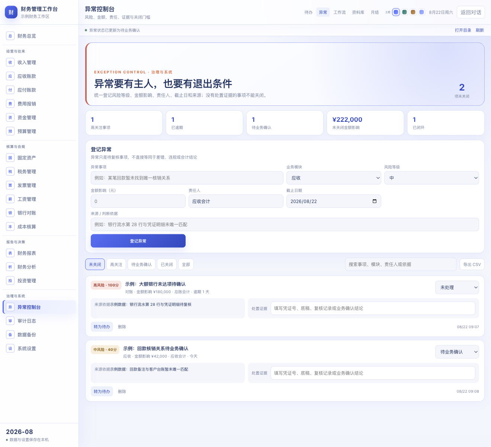
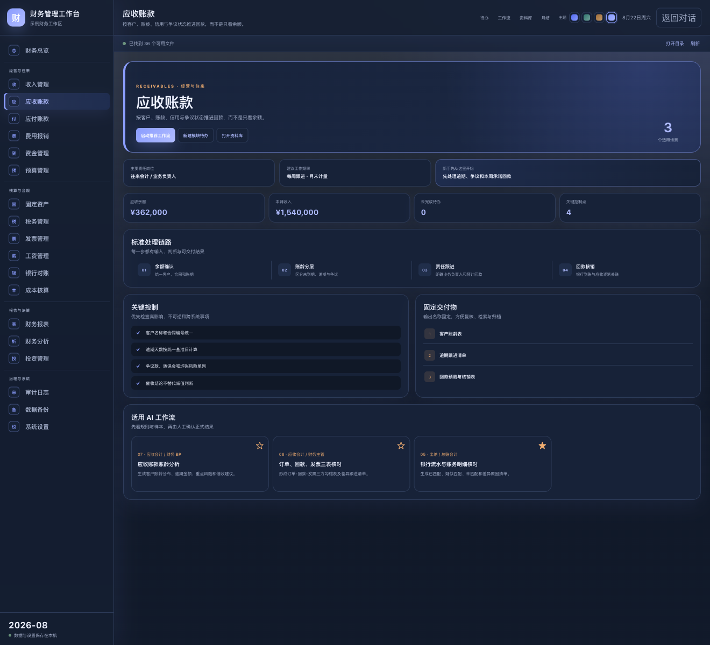

<div align="center">

# AI智能体财务工作台

## 把财务日常、异常闭环与 AI 工作流，放进一个真正可操作的专业工作台。
***欢迎添加微信：weihuiaccounting 进一步交流学习***


[](https://github.com/feng-liu-1994/workbuddy-finance-workbench/actions/workflows/ci.yml)
[](https://github.com/feng-liu-1994/workbuddy-finance-workbench/releases/latest)
[](https://www.codebuddy.cn/docs/cli/mcp-apps)
[](LICENSE)

[一键安装](#30-秒安装) · [功能说明](#不是一张看板而是一套财务闭环) · [使用边界](#数据与专业边界) · [开发文档](#开发与验证)


</div>

这是一个面向财务人员和财务 FDE 场景的开源工作台。它不是只有提示词的 Skill：在 **WorkBuddy 中可直接打开完整交互界面**，在 **DeepSeek Harness 中可作为原生侧栏应用运行**，也保留通用 Agent Skill 供 Codex、Claude Code 等工具读取。

界面采用克制的雾光层次与高可读字号，不使用夸张高光、塑料质感或密集小字。内置 20 个工作模块、25 个 AI 工作流、异常责任闭环、月结证据控制、经营快照、资料索引和本机备份。

## 先选对安装方式

| 使用环境 | 得到什么 | 推荐入口 |
|---|---|---|
| **WorkBuddy** | 完整图形工作台 + 25 个工作流 + Skill | [一键安装完整应用](docs/INSTALL_WORKBUDDY.md) |
| **DeepSeek Harness** | 左侧导航中的原生完整工作台 | [安装 DSH 插件](docs/INSTALL_DSH.md) |
| **Codex / Claude Code / 其他 Agent** | 财务规则、工作流与验收清单；不含图形界面 | [安装通用 Skill](docs/INSTALL_AGENT.md) |

> 三种方式共用同一套财务口径和工作流。图形界面的承载方式不同：WorkBuddy 使用 MCP App Widget，DeepSeek Harness 使用原生 UI 插件，其他 Agent 使用 Markdown/JSON Skill。

## 30 秒安装

### macOS：WorkBuddy 完整版

1. 下载 [WorkBuddy macOS 安装包](https://github.com/feng-liu-1994/workbuddy-finance-workbench/releases/latest/download/workbuddy-finance-workbench-macos.zip)。
2. 解压，双击 **`安装 WorkBuddy 财务工作台.command`**。
3. 保存 WorkBuddy 中正在编辑的内容，完全退出后重新打开。
4. 在 WorkBuddy 输入：**`打开财务工作台`**。

安装器会先备份已有 Skill 与 `.mcp.json`，只新增 `finance-workbench` 配置项；不会读取财务文件、API Key，也不会强制重启 WorkBuddy。首次安装前需要 [Node.js 20+](https://nodejs.org/zh-cn/download)。

### Windows：WorkBuddy 完整版

下载 [WorkBuddy Windows 安装包](https://github.com/feng-liu-1994/workbuddy-finance-workbench/releases/latest/download/workbuddy-finance-workbench-windows.zip)，解压后在目录中打开 PowerShell：

```powershell
powershell -ExecutionPolicy Bypass -File .\scripts\install-workbuddy-app.ps1
```

### 从源码安装

```bash
git clone https://github.com/feng-liu-1994/workbuddy-finance-workbench.git
cd workbuddy-finance-workbench
./scripts/install-workbuddy-app.sh
```

完整安装、更新、卸载和排障步骤见 [WorkBuddy 新手安装指南](docs/INSTALL_WORKBUDDY.md)。

## 不是一张看板，而是一套财务闭环

| 工作层级 | 模块 | 解决的问题 |
|---|---|---|
| 经营与往来 | 收入、应收、应付、报销、资金、预算 | 业务确认、账龄、付款排期、13 周资金预测与预算偏差 |
| 核算与合规 | 资产、税务、发票、工资、对账、成本 | 台账勾稽、期间截止、重复识别、证据链与分摊复核 |
| 报告与决策 | 报表、分析、投资 | 报表勾稽、差异归因、管理摘要、情景测算与投后跟踪 |
| 治理与系统 | 异常、审计、备份、设置 | 责任到人、期限跟踪、处置证据、本机留痕与口径治理 |

每个业务模块都给出责任岗位、建议频率、第一步、关键控制、固定交付物和推荐工作流。每个 AI 工作流都包含输入、字段口径、处理规则、7 步执行路径、交付成果、验收清单和人工复核点。

<table>
  <tr>
    <td width="50%"><br><sub><b>异常控制台</b>：风险、金额、责任人、期限、来源与处置证据</sub></td>
    <td width="50%"><br><sub><b>4 套专业主题</b>：雾光靛蓝、松石墨绿、暖砂棕金、夜航深色</sub></td>
  </tr>
</table>

### 财务控制不是“发现异常”就结束

异常控制台会按风险等级、金额影响和逾期状态排序。没有处置证据的事项不能关闭；任何异常都可以转成待办或导出 CSV。经营快照、待办、月结、异常、收藏、字段字典和审计日志可以整体导出为 JSON 备份。

### 新手第一次使用

1. 在“系统设置”选择主题，填写主体、期间和重要性阈值。
2. 在“财务总览”录入本期汇总数，先看经营快照与今日节奏。
3. 用仓库中的[虚构演示数据](examples/demo/README.md)打开一个工作流试跑。
4. 先确认字段映射、口径、异常规则和预期输出，再处理 20–50 行样本。
5. 人工复核后再处理全量；取得底稿、凭证号或业务确认后关闭异常。

## WorkBuddy 完整版如何工作

安装包同时部署两部分：

- `MCP App`：在 WorkBuddy 对话中打开全屏交互工作台；工作流按钮会把结构化任务填入输入框，发送前由你核对附件。
- `finance-workbench Skill`：为 WorkBuddy 提供财务规则、执行边界和 25 个标准场景。

Widget 资源完全本地打包，不依赖 CDN。MCP App 采用 WorkBuddy 官方的 `text/html;profile=mcp-app` 资源协议；终端型客户端会自然降级为文字结果。

## 数据与专业边界

- 仓库只包含虚构演示数据，不包含真实发票、流水、身份信息、密码、Cookie、Token 或 API Key。
- 经营快照、待办、异常、字段字典和设置默认保存在当前应用的浏览器本机存储中。
- Widget 中选择文件只建立当前会话索引；执行工作流前仍需在 WorkBuddy 输入框确认并添加原始附件。
- JSON 备份不包含原始财务文件；更新与卸载脚本保留带时间戳的配置副本。
- AI/OCR 结果不能直接替代入账、付款、纳税申报、薪资发放或重大专业判断的人工复核。

详见 [安全政策](SECURITY.md)。

## 项目结构

```text
workbuddy/                  已构建的 WorkBuddy MCP App
agents/finance-workbench/   通用财务 Agent Skill
src/                        WorkBuddy / DSH 共用界面与业务源码
scripts/                    安装、卸载、构建、脱敏与发布验证
docs/                       图文安装、排障与版本说明
examples/demo/              完全虚构的练习数据
test/                       单元、协议与发布完整性测试
```

## 开发与验证

要求 Node.js 20+：

```bash
npm ci
npm run verify:release
```

发布校验覆盖：20 个导航模块、25 个工作流、异常关闭门槛、目录穿越防护、备份格式、WorkBuddy MCP 协议、256 KB Widget 上限、隔离目录安装/卸载、公开文件脱敏扫描、生产构建和 npm 发布清单。

## 文档

- [WorkBuddy 完整应用安装](docs/INSTALL_WORKBUDDY.md)
- [DeepSeek Harness 完整界面安装](docs/INSTALL_DSH.md)
- [Codex / Claude / 通用 Agent Skill](docs/INSTALL_AGENT.md)
- [常见问题与排障](docs/TROUBLESHOOTING.md)
- [更新记录](CHANGELOG.md)
- [参与贡献](CONTRIBUTING.md)

## 开源许可

代码采用 [MIT License](LICENSE)。欢迎提交 Issue 和 Pull Request；财务处理结果请由具备权限和专业判断能力的人员复核。
