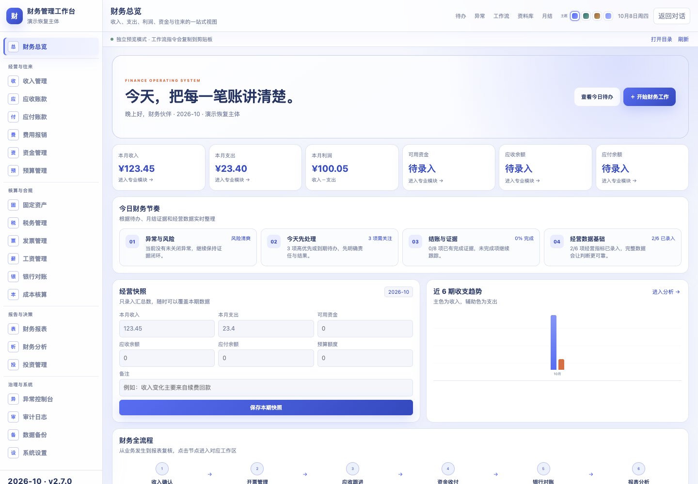
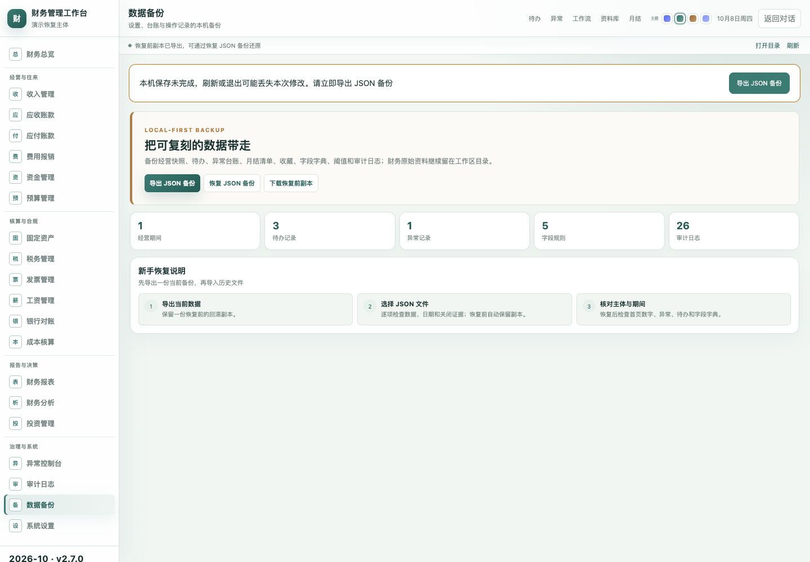

# 财务工作台全面检查与升级报告

检查日期：2026-10-08。基线为 `main` 的 `c24d985`（v2.6.0），升级版本为 **v2.7.0**。升级前保留了完整 Git 历史备份；没有安装到现有宿主，也没有重启用户正在使用的应用。

## 检查结论

原有 20 个业务模块、25 个完整工作流及 WorkBuddy MCP App、DSH UI 插件、通用 Agent Skill 三种入口均保留。资料搜索、筛选、置顶、引用、下载及任务要求仍可使用。

本次修复了 CI 复刻清单过期、安装失败破坏旧目录、备份字段遗漏、异常与日期校验不足、存储失败不提示、金额尾差、CSV 公式文本、目录符号链接越界和复制结果误报等问题。源码、构建产物、版本元数据、文档和安装包一起更新。

## 发现与修复

| 范围 | 原有问题 | 修复与证据 |
|---|---|---|
| 依赖 | 官方 npm 审计发现 5 个漏洞项，包含高危和严重项 | MCP SDK 更新至 1.32.1，更新 Zod 与相关传递依赖；同一官方源复审为 0 漏洞 |
| CI | 依赖变化后源码 SHA-256 清单过时，使既有 CI 测试失败 | `check` 先构建并刷新复刻包，再逐项验证完整性；增加 Linux Node 20/22/24 和 Windows Node 24 检查 |
| 版本 | 多处硬编码版本，容易出现宿主、Skill 与包版本不一致 | 版本从 `package.json` 同步生成，自动检查锁文件、插件、MCP App 和 Skill |
| 文件写入 | 上传子目录、临时文件或工作流目录可能被符号链接指向工作区外 | 逐层检查普通目录、真实路径和临时文件；分块写入前复检；上传与工作流快照均有回归测试 |
| 文件请求 | 非法分块与下载偏移需要在实际方法中再次校验 | 校验 Base64、长度、顺序、工作区归属和偏移；限制未完成上传数量；忙碌上传不被超时清理 |
| 安装与卸载 | 旧实现可能在发现配置损坏之前替换已有应用 | Shell 与 PowerShell 共用先预检、暂存、独立备份、切换、失败回滚逻辑；保留其他 MCP 配置和用户自定义财务环境配置 |
| JSON 备份 | 没有包含资料置顶和最近工作流；损坏条目可能导致界面出错 | 保留 v2 格式并补齐字段；校验日期、标识、状态、证据、金额与列表；旧备份缺可选字段时保留当前记录 |
| 恢复过程 | 逐项写入失败可能留下一半恢复的数据 | 写入前保存恢复前副本；失败回滚已改字段；增加副本下载入口；权限持续拒绝导致回滚失败时明确告知 |
| 本机存储 | 损坏数据及权限、容量错误被忽略；快速刷新可能丢主题 | 损坏原存储不被默认值覆盖；修改后立即保存；包括完全拒绝存储访问在内的故障显示备份提示 |
| 异常闭环 | 已关闭异常删除证据后仍保持关闭 | 缺少处置证据时禁止关闭，删除证据后重新打开并记录操作 |
| 金额和 CSV | 两位分值显示不稳定，浮点合计可能出现尾差，文本可能被表格当公式 | 金额按分处理、统一两位小数；公式样式文本加保护前缀 |
| Widget | 复制失败仍可能报告成功，引用选择未进入实际指令 | 对发送和复制结果分别检查；引用子集与完整任务要求进入实际提示词；资料索引上限明确显示 |
| 发布包 | npm 包缺配套卸载脚本与共用安装文件 | 补齐安装辅助文件、卸载脚本和文档；分别生成 macOS、Windows、Agent、npm 包及 SHA-256 清单 |

MCP SDK 漏洞依据见 [GitHub 官方安全公告](https://github.com/advisories/GHSA-6qxp-vccf-f47h)。依赖更新保留 DSH 协议、MCP Apps 和 Preact 的现有兼容版本线，避免无证据切换宿主协议。

## 验证记录

- **54 项自动测试**：业务工具、上传防覆盖与越界、提示词、备份校验、损坏存储、拒绝存储、恢复回滚、安装器、复制、版本一致性、MCP stdio 和复刻包完整性。
- `npm ci`、`npm run verify:release`、公开内容扫描、包内容检查和安装/卸载临时目录验收。
- `npm run audit:deps` 使用官方 npm 源，结果为 **0 vulnerabilities**。原镜像审计接口不支持该请求，未将接口错误视为安全通过。
- 桌面真实 Chromium：20 个模块可导航，25 个工作流可打开；25 份复制文本逐字等于源码组合器输出；填写的任务要求与引用资料进入启动指令。
- 4 个主题切换后立即刷新，选择仍保留；合成收入 123.45、支出 23.40，利润显示 **100.05**。
- 资料选择、搜索、置顶、引用、下载完成；下载内容与合成原文件完全一致。
- 异常无证据不可关闭，补证后可关闭，删除证据后重新打开；CSV 可导出。
- 备份包含置顶和最近记录；非法备份保留现状；有效备份恢复；恢复前副本可下载。
- 模拟存储容量失败、损坏存储和两种复制方法同时失败，均显示实际失败提示。目标功能浏览器错误为 **0**。
- **390px 窄屏**：页面、文档和内容宽度均为 390px，没有横向溢出。截图仅含合成数据。

CI 配置已加入跨平台和 Node LTS 验证；GitHub 实际运行结果以升级 PR 的 Checks 为准。

## 界面证据

桌面：



390px 窄屏：


保存失败提示与导出入口：



## 使用与恢复

```bash
npm ci
npm run preview
```

在浏览器打开 `http://127.0.0.1:4173`。正式安装使用 [WorkBuddy 安装指南](INSTALL_WORKBUDDY.md)。旧版 JSON 备份仍使用 v2 格式，导入前先导出当前备份。

安装器保留配置、应用和 Skill 的独立备份目录；不要在未核对之前清理这些副本。财务 JSON 备份包含设置与台账，不包含原始财务文件；原文件须另行保存。

## 尚待宿主验收的部分

独立 Widget 预览、MCP stdio 测试和临时目录安装已验证。真实 WorkBuddy / DSH 的插件加载、对话输入框填入、附件处理和 AI 实际执行仍需在对应宿主内验收，不能由独立预览替代。

DSH 的旧 Shell 安装器针对现有 Web profile 布局；官方 Desktop 使用宿主管理入口。本次没有改动用户现有模型、登录状态、聊天记录、工作区或财务原件。

代码提交与安装包生成不等于已合并 main 或正式发布 Release；下载页面在合并发布前仍以已发布版本为准。
